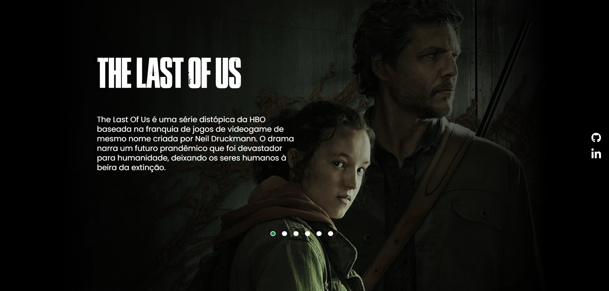

# Projeto The Last Of US

Projeto de desenvolvimento em HTML, CSS e JavaScript junto com os irmãos do DevEmDrobro.

  <a href="#-tecnologias">Tecnologias</a>&nbsp;&nbsp;&nbsp;|&nbsp;&nbsp;&nbsp;  
  <a href="#-projeto">Projeto</a>&nbsp;&nbsp;&nbsp;|&nbsp;&nbsp;&nbsp;  
  <a href="#-gif">Gif</a>&nbsp;&nbsp;&nbsp;&nbsp;&nbsp;&nbsp;

 

## 🚀 Tecnologias

Esse projeto foi desenvolvido com as seguintes tecnologias:

- HTML
- CSS
- JavaScript
- Git e Github

 

## 💻 Projeto

Projeto realizado com os irmãos do DevEmDobro, criando uma página do The Last Of US, com Javacript é possível navegador e alterar as imagens. É uma página responsive e reset, sendo possível aceessar por celulares, tablets e desktop.

 

## 📸 Gif
Página do The Last Of US

</img>

 

---

Feito com ♥ by Thamyres Cavalcante.

